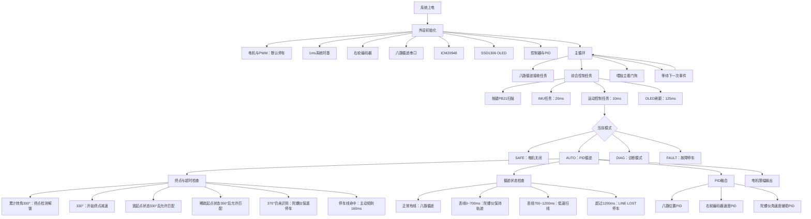

# 对话记录 第 21 部分

会话 ID：`019fb683-28ab-7eb3-adbd-3c44aa83ff61`

## 321. 助手

- 未烧录
- 新提交：`4ead36e revert: restore exact bc0f445 behavior`

::git-commit{cwd="D:\TI\mspm0_sdk_2_02_00_05\电赛备用2"}

## 322. 用户

多次实验60%成功率，但是停车误差很大，差不多8cm，是失败的是走一段就显示 LAP DONE ，还有就是LIN LOST，有一些路段八路寻迹确实识别不到，然后陀螺仪你再校准一下，

## 323. 助手

我会针对三个失败点一起改：杜绝短程误判 `LAP DONE`、让真实丢线段用陀螺仪辅助跨过去、重新做 ICM20948 静止零偏校准。不会改正常循迹速度，也不会烧录；完成后编译并自动 Git。由于涉及电机和 IMU 闭环，我先按嵌入式安全检查流程审查现有逻辑。

## 324. 助手

定位到两个明确原因：

- 短程 `LAP DONE`：`bc0f445` 对“三路以上的起点图案”只限制了 1 秒，没有要求真的转满一圈，所以普通宽线可能误触发。
- `LINE LOST`：当前只给 500 ms，并且先把上次电机命令压到 55%，遇到真实无反射区时容易还没跨过去就超时。

我会把终点判定统一加上“接近一整圈”的陀螺仪门槛；丢线时先按原轨迹并用陀螺仪稳住方向，再进入找线，总上限放宽到 1.2 秒。IMU 校准则改成只接收连续静止样本，防止把搬动车辆时的角速度当成零偏。

## 325. 助手

代码已经完成三项联动修正。启动循迹现在必须等 OLED 校准到 `150/150`，按键启动瞬间会把当前方向重新置为 `YAW=0`；这样终点门槛和丢线航向保持都从同一个起点计算。现在进行全量编译，重点检查浮点限幅、格式参数和状态超时。

## 326. 助手

全量编译通过：0 错误、0 警告。最后安全核对也通过：电机硬限幅仍为 55%，盲走只允许 1.2 秒，找不到线仍会安全停车；本次没有启用 ADC 或蓝牙，也没有改正常圈速参数。现在只提交四个相关源码文件。

## 327. 助手

已针对三类失败完成修改：

- `LAP DONE` 误触发：必须累计转向接近一圈后才允许停车。宽停车线需 ≥330°，普通稀疏起点状态需 ≥350°。
- 停车越线：330°后逐步减速，终点附近约18.5%输出；停车线刚进入约三路传感器时即可提前主动短刹。
- `LINE LOST`：前700ms沿原轨迹行驶并用陀螺仪稳住方向，随后低速扫线；总计1.2秒仍未恢复才停车。
- 陀螺仪：改成150个连续静止样本校准，按键启动时自动将当前方向置为 `YAW=0`。

测试时，上电后保持小车完全静止约3秒，等 OLED 的 `YAW:CAL` 完成后再按 PB21。提前按会显示 `AUTO:WAIT IMU`，校准完成后再按一次即可。

Keil 编译：`0 Error(s), 0 Warning(s)`，未烧录。

提交：`3977b74 fix: harden lap finish line recovery and gyro calibration`

::git-commit{cwd="D:\TI\mspm0_sdk_2_02_00_05\电赛备用2"}

## 328. 用户

生成任务树给我看

## 329. 助手

当前程序不是 RTOS，而是主循环轮询调度，任务树如下：

具体运行顺序：

1. 上电后电机保持关闭。
2. ICM20948采集150个连续静止样本，约3秒完成零偏校准。
3. OLED显示 `YAW:CAL x/150`；未完成时按PB21显示 `AUTO:WAIT IMU`。
4. 校准完成后按PB21：

   - 当前方向自动设为 `YAW=0`。
   - 保存按键前八路循迹状态。
   - 两秒内平滑提升起步速度。
   - 进入八路循迹＋编码器＋陀螺仪联合控制。

5. 正常循迹：

   - 八路模块控制线路位置。
   - 直线时右轮编码器控制速度。
   - 转弯时陀螺仪角速度抑制摆头。
   - 最终电机输出硬限幅为55%。

6. 一圈停车：

   - 330°后逐渐降低速度。
   - 回到启动前的八路状态后立即主动短刹。
   - 若漏检停车线，累计370°时陀螺仪强制停车。
   - OLED显示 `LAP DONE`。

## 330. 用户

程序错误，，一直卡在CAL TAW中，

